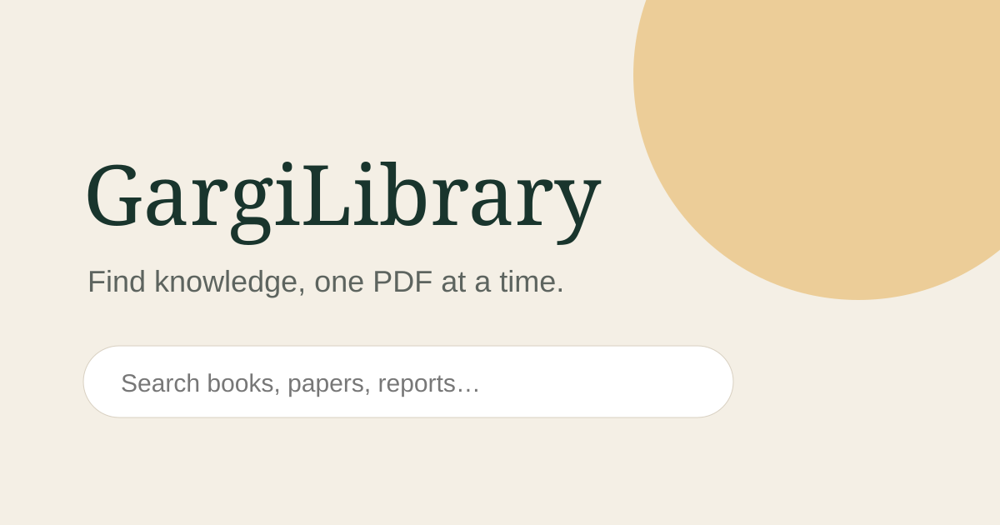

# GargiLibrary

> Find knowledge, one PDF at a time.

> **AI development disclosure:** GargiLibrary was designed, written, documented, and tested entirely with artificial intelligence using [OpenAI Codex](https://openai.com/codex/), under human direction. Contributions may be human-written, AI-assisted, or AI-generated; contributors must review and take responsibility for everything they submit.

GargiLibrary is a focused, privacy-conscious PDF discovery engine for research papers, books, reports, manuals, and other documents published openly on the web. It combines OpenAlex, Internet Archive, optional Google Programmable Search, and in-browser PDF inspection to show direct document links, source domains, page counts, and first-page previews when publishers permit cross-origin access.



## Features

- Real, no-key PDF discovery through OpenAlex and Internet Archive
- Optional whole-web PDF results through the official Google Custom Search JSON API
- One-click Google `filetype:pdf` dorks for the wider web and AWS/S3-hosted documents
- Optional `site:` filtering and relevance/date sorting
- Direct links to the publisher's original PDF
- First-page thumbnail and page-count extraction with PDF.js
- Search URLs that can be bookmarked and shared
- Responsive, accessible interface with a zero-backend deployment
- SEO essentials: metadata, Open Graph, structured data, canonical URL, sitemap, and robots.txt
- No embedded API secrets; credentials stay in the user's browser local storage

## Quick start

```bash
npm install
npm run dev
```

Search works immediately without setup. To add Google results directly to GargiLibrary's unified result cards, open the settings button and enter:

1. A [Google Custom Search JSON API](https://developers.google.com/custom-search/v1/overview) key.
2. A [Programmable Search Engine](https://programmablesearchengine.google.com/) ID configured to search the entire web.

Without Google credentials, GargiLibrary still returns real open documents from OpenAlex and Internet Archive.

## How search works

GargiLibrary queries OpenAlex and Internet Archive for openly available documents. If Google is configured, it also sends the query to Google's supported JSON API with `fileType=pdf`. It does **not** scrape Google result pages; the Google dork button opens Google's own result page instead. When a result host permits browser access, PDF.js downloads the document, counts its pages, and renders the first page locally. Some publishers block cross-origin requests; those results remain searchable and linkable but may not show a page count or generated preview.

The app indexes nothing itself, does not host files, and links to documents at their original sources. Users are responsible for respecting copyright, licenses, access controls, and applicable law.

## Production build

```bash
npm run build
npm run preview
```

The production site is published from the generated `docs/` directory on the `main` branch through GitHub Pages. Maintainers can rebuild it with `npm run build` and copy the contents of `dist/` into `docs/` before publishing a release.

## Repository topics

`pdf-search` · `search-engine` · `digital-library` · `research-tools` · `pdfjs` · `react` · `vite` · `typescript` · `google-custom-search`

## Privacy and security

API credentials are stored only in browser local storage and sent directly to Google's API. Restrict your API key to the deployed site origin in Google Cloud Console. For a multi-user production service, use a small server-side proxy with quotas rather than distributing a shared unrestricted key.

## License

[MIT](LICENSE)

## Contributing

GargiLibrary is open to contributions of all kinds—search providers, accessibility improvements, metadata extraction, interface refinements, documentation, and bug fixes. Read [CONTRIBUTING.md](CONTRIBUTING.md) before opening a pull request, and follow our [Code of Conduct](CODE_OF_CONDUCT.md).
